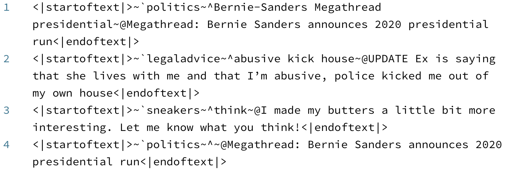

# gpt-2-keyword-generation

A method for encoding a dataset of text documents into a form that when finetuned with [OpenAI](https://openai.com)'s [GPT-2](https://openai.com/blog/better-language-models/), the network will be able to generate text pertaining to the specified keywords (although the encoded text can theoetically work with any type of text-based neural network generation, it leverages GPT-2's long horizon and strong context abilities).

You can demo the results w/ an example on how to use the script in the `example` folder. Additionally, you can play with keywords yourself with the [Reddit GPT-2 API](https://minimaxir.com/apps/gpt2-reddit/) ([GitHub](https://github.com/minimaxir/reddit-gpt-2-cloud-run)), or read [pregenerated examples](https://www.reddit.com/r/legaladviceofftopic/comments/bxi869/i_trained_an_ai_to_generate_the_ultimate/) of that keyword-based model on /r/legaladvice.

The encoding is tokenized using [spaCy](https://spacy.io) for more robust keyword tokenization and parallelized using [ray](https://github.com/ray-project/ray) in order to massively speed up encoding on large datasets (about 11x speedup using 32 vCPUs/threads vs. single threaded, at 70% CPU utilization)

## Usage

This repo contains a `keyword_encode.py` script which attempts to extract the keywords in an unsupervised manner (although you can provide your own keywords if you have them). The methodology is as follows for each text document:

1. Extract the keywords from each document as "keywords" using spaCy, which both tokenizes keywords and tags their parts-of-speech.
	* Only nouns, verbs, adjectives, and adverbs are extracted. Nouns use the raw version of the word (for best user experience when they input them manually) while the other POS use the lemmatized versions (to reduce overfitting but still provide information).
	* Proper nouns, named entities, and compound nouns count as their own keyword.
	* Pronouns and stop words are excluded from keywords.
	* Keywords are deduped.
2. Prepare the keywords in such a way that the document text is generated conditionally on the keywords.
	* Normalize the keywords (replace spaces/punctuation w/ dashes). The keywords are *not* case-normalized for best user experience when specifying keywords.
	* Shuffle the order of the keywords to prevent GPT-2 from cheating and learning when the order of the keywords should be written in the document proper.
	* For each set of processed keywords in a document, create `repeat` random combinations (default: 3) of the keywords. This serves as a data augmentation of sorts, and prevents the model from overfitting on a given set of keywords.
	* For each combination above, select a random number of *up to* `max_keywords` (default: 3), which are then shuffled, to prevent the neural network from a) learning the number of keywords as a hint to the length of the text and b) the order of the keywords in the resulting text.
3. Write the keywords, then the document for each generated set of keywords.
	* The documents are processed in batches with ray; after each batch is encoded, the batch is shuffled before writing to reduce leakage.

The default case (passing a CSV of `titles`) generates `keywords`, and outputs a `.txt` of keywords and titles.

The `keyword_decode.py` script contains functions for decoding bulk-generated encoded texts (e.g. generated through gpt-2-simple, albeit the native truncation is recommended in that use case). `decode_texts()` will extract the text from each of the specified taxonomic sections for the provided list of texts, and `decode_file()` can extract and decode all texts and write to a file.

## Taxonomy

This script is also capable of handling additional hierarchal conditions. This script has 4 total possibilities implemented:
`category`, `keywords`, `title`, and `body`.

`category` is the broadest scope of a given text. (e.g. the subreddit of a given post, the speaker of a given phrase if using for chatbots)

`body` is used if there's a large amount of text dependant on `title` (e.g. a blog post).

See the code for more information.

## Helpful Notes

* There is no explicit mathematical/theoetical basis behind the keywords aside from the typical debiasing of the text; despite that, the results are good, and there is still room for improvement!
* The keywords will not be present in the resulting text 100% of the time, but the presence of keywords in the text is still high.
* The scope of the text document(s) plus the keywords must be within GPT-2's max 1023 token scope (e.g. should only be a few paragraphs max).
* Manual keywords may work better if you have them, which you can set with the `keywords_field` parameter to `encode_keywords()`.
* There should be an equal amount of all unique `category` documents to prevent sampling bias.
* The delimeters are chosen to be single, uncommon ASCII characters that are relatively unlikely to be used anywhere else, such that the network explicitly learns the significance of those characters. (see [Wired](https://www.wired.com/2013/08/the-rarity-of-the-ampersand/) and [Stack Overflow](https://stackoverflow.com/questions/492090/least-used-delimiter-character-in-normal-text-ascii-128) on the character rarity). It may be better in the future to base delimiters on GPT-2 BPEs, but that is less robust.
* You can actually use *more* than `max_keywords` keywords when generating from a model with GPT-2, although results will vary.

## Maintainer/Creator

Max Woolf ([@minimaxir](https://minimaxir.com))

*Max's open-source projects are supported by his [Patreon](https://www.patreon.com/minimaxir). If you found this project helpful, any monetary contributions to the Patreon are appreciated and will be put to good creative use.*

## License

MIT

## Disclaimer

This repo has no affiliation or relationship with OpenAI.